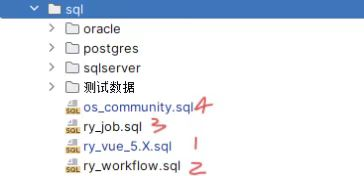
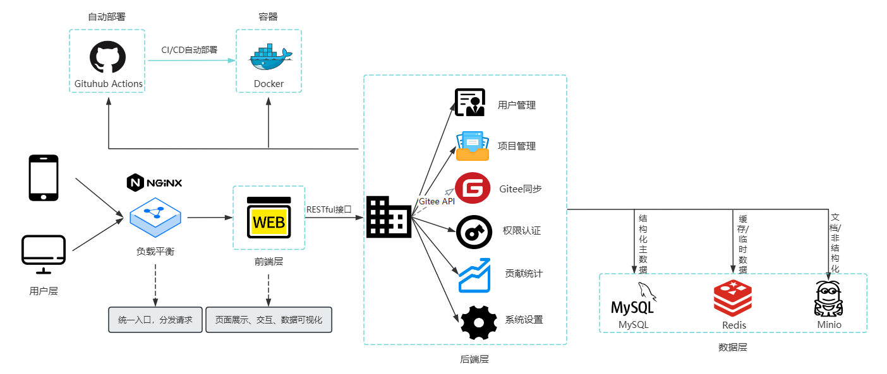

> **Dromara 开源社区一体化管理系统** 是一款基于 Spring Boot + RuoYi-Vue-Plus-Single 的开源社区管理平台，
>  提供社区项目全信息管理，项目孵化管理、人员管理、文档管理、统计分析等功能，帮助开源组织高效运营社区。

## 功能特性

**项目管理**：孵化申请、审核、进度跟踪、一键自动同步动态信息

**文档中心**：文档分类、版本管理、支持在线上传下载、集中化管理

**信息管理**：成员档案、贡献记录、自定义身份标签

**流程管理**：流程分类、状态流转、审批节点

**仪表盘**：社区数据总览，实时同步 Gitee 数据

## 技术栈

| 层级       | 技术/工具                                               |
| ---------- | ------------------------------------------------------- |
| 前端       | Vue 3、Element Plus、TailwindCSS、ECharts、Axios        |
| 后端       | Spring Boot 3.x、MyBatis-Plus、RuoYi-Vue-Plus、Sa-Token |
| 数据库     | MySQL、Redis                                            |
| 运维/部署  | Docker、Nginx、Maven、Node.js                           |
| 第三方服务 | Gitee OpenAPI（项目/贡献者数据同步）                    |
| 其他       | Lombok、MapStruct、日志组件（SLF4J + Logback）          |

## 核心模块结构

```asp
root/
├─ plus_ui/               # 前端 UI 项目
│   ├─ src/
│   │   ├─ components/
│   │   ├─ views/
│   │   ├─ api/
│   │   ├─ router/
│   │   ├─ store/
│   │   ├─ utils/
│   │   └─ assets/
│   ├─ public/
│   ├─ package.json
│   └─ build scripts...
├─ ruoyi_osc/              # 后端主业务模块
│   ├─ src/main/java/
│   │   ├─ controller/
│   │   ├─ service/
│   │   ├─ mapper/ / repository
│   │   ├─ domain/entity/
│   │   ├─ dto/
│   │   ├─ security/
│   │   ├─ config/
│   │   └─ util/logging / exception etc.
│   ├─ src/main/resources/
│   │   ├─ application.yml
│   │   ├─ mapper xmls (若用 XML 映射)
│   │   └─ static/resources
│   └─ pom.xml / build.gradle
├─ ruoyi-common/           # 公共工具／实体／基础功能
├─ ruoyi-modules/          # 各业务模块（如文章、项目、社区等）
├─ ruoyi-extend/           # 扩展或插件功能
├─ script/                 # 数据库 SQL 初始化脚本／升级脚本／部署脚本
├─ .gitignore
├─ README.md
└─ LICENSE
```

## 快速开始

#### 环境要求

- JDK 17+
- Node.js 18+
- MySQL 8.0+
- Redis 6+

#### sql导入

默认使用mysql数据库导入，依次导入运行以下脚本：

  

#### 本地运行

```bash
-- 克隆仓库
git clone https://gitee.com/sssixxx/dromara-osc-ms.git
cd dromara-osc-ms

-- 启动后端
# 配置数据库连接（src/main/resources/application-dev.yml 
# 修改 spring.datasource 中的 url / username / password
# 修改 redis 中的 host / password
启动顺序：mysql - redis - admin 
可选启动：minio 文件上传 monitor 系统监控

-- 启动前端
cd plus_ui
npm install
npm dev
```

## 架构图



## 配置说明

- `application.yml`：数据库、Redis、Gitee API token
- `VITE_APP_CONTEXT_PATH`：前端接口地址

## 致谢

- 感谢 Dromara 开源社区
- 感谢唐导师耐心指导和及时点拨
- 参考了 RuoYi-Vue-Plus 等优秀开源项目

## 部署使用文档

> 部署使用流程与脚手架项目一致，具体可查看 [RuoYi-Vue-Plus](https://gitee.com/dromara/RuoYi-Vue-Plus) 和 [plus-doc](https://plus-doc.dromara.org)


