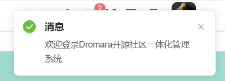
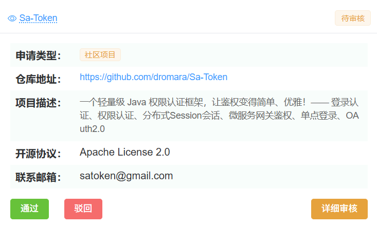
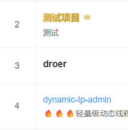
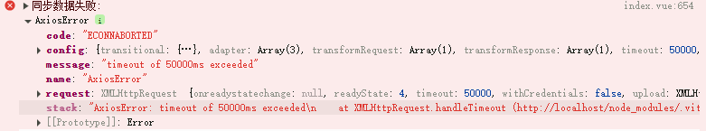

# Dromara 开源社区一体化管理系统 — 测试文档

## 1. 文档信息
- **版本**：v1.0
- **编写人**：刘美琴
- **编写日期**：2025年9月8日
- **更新日期**：2025年9月12日

---

## 2. 测试目的
- 验证系统各模块是否满足项目需求中的功能要求。
- 确保接口、页面、数据同步、上传下载等功能稳定可靠。
- 验证权限控制、项目孵化流程、异常处理等安全逻辑。

---

## 3. 测试范围
- 前端（Vue3 + Element Plus）交互
- 后端接口（Spring Boot + MyBatis Plus）
- 数据库读写（MySQL / Redis）
- 文档上传（MinIO）
- 系统监控（Monitor 模块）
- 与 Gitee API 的数据同步

---

## 4. 测试环境
| 项目 | 配置 |
|------|------|
| 操作系统 | Windows 11 / Ubuntu 22.04 |
| JDK | 17 |
| Node.js | 18.x |
| MySQL | 8.0 |
| Redis | 7.x |
| MinIO | RELEASE.2025-01-01 |
| 浏览器 | Chrome 139+ |
| 部署方式 | 本地运行 / Docker Compose |

---

## 5. 测试策略
- **单元测试**：后端业务逻辑、工具类、权限校验。
- **接口测试**：RESTful API，重点验证项目管理、文档管理接口。
- **功能测试**：菜单、角色、用户、项目管理等模块页面操作。
- **集成测试**：前端与后端、Redis、MinIO、Gitee API 的集成。
- **安全性测试**：JWT 有效期、越权访问、输入合法性。
- **性能测试**（可选）：接口并发、Redis 缓存命中率。

---

## 6. 测试用例表
| 用例编号 |   模块   | 测试标题                       |                      前置条件                      |                           操作步骤                           |                           预期结果                           |
|------|:----:|:-----|:----:|:----:|:----:|
| TC001    |   登录   | 输入正确账号密码               |                    服务正常启动                    |       打开登录页 → 输入 `admin / 666666` → 点击“登录”        |                跳转首页，接口返回有效 `token`                |
| TC002    | 角色管理 | 新增角色                       |                    管理员已登录                    |         系统管理 → 角色管理 → 新增 → 填写信息 → 保存         |                   角色列表显示新建角色数据                   |
| TC003    | 文档管理 | 上传文档                       |                  MinIO 服务已启动                  |        打开“文档管理” → 点击“上传” → 选择文件 → 确认         |                   上传成功，列表中显示文件                   |
| TC004    | 会话过期 | token 过期后访问接口           |           登录后手动修改 token 使其过期            |                         再次请求接口                         |                 返回“会话已过期，请重新登录”                 |
| TC005    | 孵化申请 | 不同孵化类型表单转换与提交审核 |      系统已启动，用户已登录且具备孵化申请权限      | 进入「孵化申请」页面 → 选择不同“孵化类型”（社区项目 / 个人项目等） → 填写表单 → 点击「提交审核」 → 回到申请列表并点击“继续编辑” | 表单字段随孵化类型动态变化；提交后状态为“待审核”；继续编辑时加载正确数据，可修改未锁定项 |
| TC006    | 项目审核 | 社区项目升级通过后标识展示     | 已存在“社区项目升级为顶级项目”的申请，审核员已登录 | 打开「项目审核」 → 选中待审核的“社区项目升级”申请 → 审核通过 → 返回「项目列表」 |  列表显示“升级”特殊标识；项目名称字体为金色；状态为“已通过”  |
| TC007    | 同步数据 | 点击同步数据刷新项目最新信息   |   系统正常运行，数据库已有项目记录，同步接口可用   | 登录后台首页或项目管理页面 → 点击“同步数据” → 等待完成并刷新页面 | 页面提示“同步成功”；列表中的 star、fork、最后提交时间等字段更新为最新值 |

---

## 7.测试结果表

| 用例编号 | 实际结果 |                           测试截图                           |
| -------- | -------- | :----------------------------------------------------------: |
| TC001    | ✅ 通过   |  |
| TC002    | ✅ 通过   |  |
| TC003    | ✅ 通过   |  |
| TC004    | ✅ 通过   |  |
| TC005    | ✅ 通过   |  |
| TC006    | ✅ 通过   |  |
| TC007    | ❌ 超时   |  |

------

## 8. 缺陷记录

| 编号 | 描述 | 严重程度 | 状态 | 解决人 |  |
|:----:|:----:|:----:|:----:|:----:|:----:|
| BUG001 | 同步数据功能不稳定，失败时接口请求超时 | 轻 | 已解决 | sssixxx |  |
| BUG002 | 上传大于 50MB 的文件失败 | 轻 | 待解决 |         |  |
|  |  |  |  |         |  |

---

## 9. 测试结论
- 系统主要功能均通过测试。
- 剩余问题：首页模块的数据实时有效性等边界场景需优化。
- 系统满足发布上线条件。

---

> 本文档用于指导和记录 Dromara 开源社区一体化管理系统的测试过程和结果。
